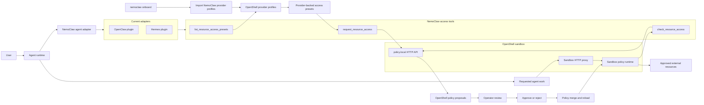

# NemoClaw OpenShell Integration

## Flow

1. The agent asks NemoClaw for allowed resource presets with `list_resource_access_presets`.
2. During onboarding, NemoClaw imports its provider profiles into OpenShell for package registries, messaging platforms, Brave Search, Jira, Hugging Face, and local inference.
3. NemoClaw builds the agent-visible preset list from OpenShell provider profiles, with built-in presets as fallback coverage for older OpenShell versions.
4. The agent calls `request_resource_access` with a preset, access mode, reason, and optional wait timeout.
5. NemoClaw submits a least-privilege proposal to `policy.local`.
6. OpenShell surfaces the proposal for operator review.
7. After approval, OpenShell merges and reloads the sandbox policy.
8. The agent calls `check_resource_access`; NemoClaw reports `applied` only after OpenShell reports the policy reload is complete.

## Agent Tools

- `list_resource_access_presets`: discovers provider-backed preset ids.
- `request_resource_access`: submits a network access proposal through OpenShell.
- `check_resource_access`: polls an existing proposal until it is pending, denied, failed, or applied.

## Adapter Contract

Each agent adapter exposes the same tool names and response shape through the harness-native mechanism. OpenClaw uses its plugin API. Hermes uses its Python plugin API. Additional harnesses can implement the same contract without changing the OpenShell policy proposal flow.

## Provider Profiles

NemoClaw imports OpenShell provider profiles for its policy presets during onboarding. Existing OpenShell profiles are left untouched, and already-imported NemoClaw profiles are skipped so repeated onboarding remains idempotent. If the OpenShell gateway does not support provider-profile import, NemoClaw continues with local fallback presets.
